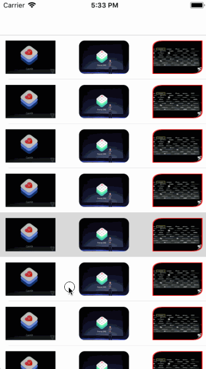

# DDCornerRadius

[](http://mit-license.org)
[](https://developer.apple.com/resources/)

             
[](https://github.com/charsdavy/DDCornerRadius/issues)
[](http://cocoadocs.org/docsets/SwiftyStoreKit/)

Optimize image fillet processing to avoid performance loss caused by off-screen rendering and optimize the stuck phenomenon.

## Installation

### CocoaPods

[CocoaPods](https://cocoapods.org/) is a dependency manager for Cocoa projects. You can install it with the following command:

```bash
$ gem install cocoapods
```

To integrate DDCornerRadius into your Xcode project using CocoaPods, specify it to a target in your `Podfile`:

```bash
source 'https://github.com/CocoaPods/Specs.git'
platform :ios, '8.0'
use_frameworks!

target 'MyApp' do
  # your other pod
  # ...
  pod 'DDCornerRadius', '~> 1.0'
end
```

Then, run the following command:

```bash
$ pod install
```

You should open the `{Project}.xcworkspace` instead of the `{Project}.xcodeproj` after you installed anything from CocoaPods.

For more information about how to use CocoaPods, I suggest [this tutorial](https://www.raywenderlich.com/156971/cocoapods-tutorial-swift-getting-started).

# Usage

import header file:

```
#import "DDCornerRadius.h"
```

plan 1：

```
imageView.image = [[UIImage imageNamed:@"demo3"] dd_imageByCornerRadius:40.0 corners:(UIRectCornerTopLeft | UIRectCornerBottomRight) borderWidth:5.0 borderColor:[UIColor redColor]];
```

plan 2：

```
imageView = [UIImageView dd_cornerWithRadius:40.0 cornerColor:[UIColor redColor] corners:(UIRectCornerTopLeft | UIRectCornerBottomRight) ];
```
# ScreenShot


